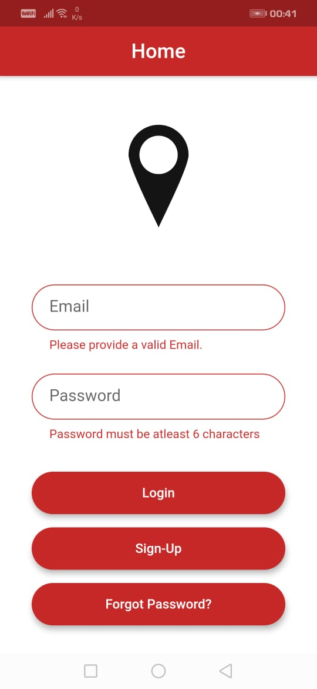
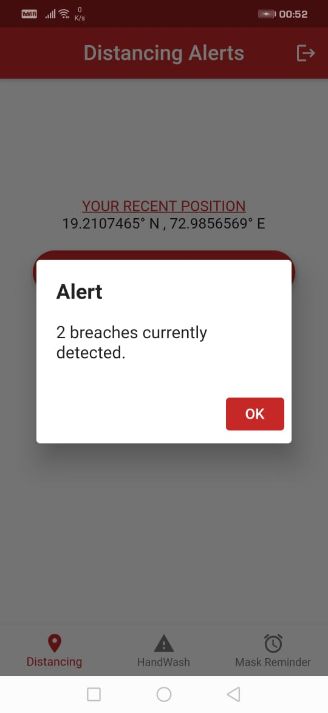
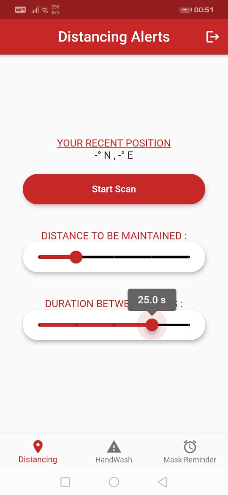

# Social Distancing App

built during COVID to help people stay safe.

## Features

- Alerts users when someone infected comes too close
- Sends reminders to wash hands and wear a mask
- User authentication and secure location storage using Firebase
- Custom settings for:
  - Distance thresholds
  - Frequency of reminders

## Screenshots

  
  

